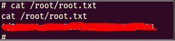

# Anonymous


## Reconnaissance

**Scanning the network for open ports and services using** `sudo nmap -sV -n -v -Pn -p- -T4 -A 10.10.108.214`

````
Nmap scan report for 10.10.108.214
Host is up (0.097s latency).
Not shown: 65400 closed ports, 131 filtered ports
PORT    STATE SERVICE     VERSION
21/tcp  open  ftp         vsftpd 2.0.8 or later
| ftp-anon: Anonymous FTP login allowed (FTP code 230)
|_drwxrwxrwx    2 111      113          4096 Jun 04  2020 scripts [NSE: writeable]
| ftp-syst: 
|   STAT: 
| FTP server status:
|      Connected to ::ffff:10.6.49.36
|      Logged in as ftp
|      TYPE: ASCII
|      No session bandwidth limit
|      Session timeout in seconds is 300
|      Control connection is plain text
|      Data connections will be plain text
|      At session startup, client count was 2
|      vsFTPd 3.0.3 - secure, fast, stable
|_End of status
22/tcp  open  ssh         OpenSSH 7.6p1 Ubuntu 4ubuntu0.3 (Ubuntu Linux; protocol 2.0)
| ssh-hostkey: 
|   2048 8b:ca:21:62:1c:2b:23:fa:6b:c6:1f:a8:13:fe:1c:68 (RSA)
|   256 95:89:a4:12:e2:e6:ab:90:5d:45:19:ff:41:5f:74:ce (ECDSA)
|_  256 e1:2a:96:a4:ea:8f:68:8f:cc:74:b8:f0:28:72:70:cd (ED25519)
139/tcp open  netbios-ssn Samba smbd 3.X - 4.X (workgroup: WORKGROUP)
445/tcp open  netbios-ssn Samba smbd 4.7.6-Ubuntu (workgroup: WORKGROUP)
Service Info: Host: ANONYMOUS; OS: Linux; CPE: cpe:/o:linux:linux_kernel

Host script results:
|_clock-skew: mean: -1s, deviation: 0s, median: -1s
| nbstat: NetBIOS name: ANONYMOUS, NetBIOS user: <unknown>, NetBIOS MAC: <unknown> (unknown)
| Names:
|   ANONYMOUS<00>        Flags: <unique><active>
|   ANONYMOUS<03>        Flags: <unique><active>
|   ANONYMOUS<20>        Flags: <unique><active>
|   \x01\x02__MSBROWSE__\x02<01>  Flags: <group><active>
|   WORKGROUP<00>        Flags: <group><active>
|   WORKGROUP<1d>        Flags: <unique><active>
|_  WORKGROUP<1e>        Flags: <group><active>
| smb-os-discovery: 
|   OS: Windows 6.1 (Samba 4.7.6-Ubuntu)
|   Computer name: anonymous
|   NetBIOS computer name: ANONYMOUS\x00
|   Domain name: \x00
|   FQDN: anonymous
|_  System time: 2021-02-09T18:25:45+00:00
| smb-security-mode: 
|   account_used: guest
|   authentication_level: user
|   challenge_response: supported
|_  message_signing: disabled (dangerous, but default)
| smb2-security-mode: 
|   2.02: 
|_    Message signing enabled but not required
| smb2-time: 
|   date: 2021-02-09T18:25:45
|_  start_date: N/A

````

## Enumerating SMB

**We notice that SMB is running on that target machine on port 445.**
**We use an nmap script to list the shares, the share name we're looking for is "pics" because "Anonymous access allows us the READ permission".**


**We use `smbclient //$IP/pics -N` to login and `ls` to list the files.** 
(*Smbclient is useful tool to test connectivity to a Windows share. It can be used to transfer files, or to look at share names*)


**The images did not contain any important information so lets move on to the ftp service on port 21**


## Enumerating FTP Service

- **First thing we notice is that theres an anonymous login for the ftp service allowed. So we jump straight into that and use anonymous:anonymous as the credentials;**


**We `ls -la` and find 3 files on this machine. We use the `get` command to transfer these files to our host machine.**


**Now that we have the txt file on our host machine we can `cat` it. When we `cat to_do.txt` we get a message.**


**We then `cat` the other 2 files (clean.sh and removes_files.log) and see;**


## Reverse Shell

**We take a closer look at the clean.sh and notice that it is a kronjob (kronjobs is most suitable for scheduling time based tasks) running on their machine. We try to modify the clean.sh file with a python reverse shell to see if its works.**


**We then replace the clean.sh file in their machine with ours useing `put clean.sh clean.sh`.**


**Now we quickly set up our netcat listener using `nc -nvlp 11234`, once the kronjob runs our python script we get a reverse shell!!**


**Use `ls` to list the files and `cat user.txt`, we're still not done. We have to escelate privileges. To do this lets run linpeas ( LinPEAS is a script that search for possible paths to escalate privileges on Linux/Unix hosts) on the their machine.**
**First lets go to the directory hosting linpeas on our remote machine and start a http server.**

## Privilege Escalation


**Now lets `wget` the file which will download linpeas on the target machine.**


**We use a simple `chmod +x`(chmod +x following by a filename, usually a script, means that you make it executable) and we run it using `./linpeas.sh`.**


**When we check the SUID permissions, we see that there is a SUID bit set which is a %95 privilege escalation vector.**


**Let's head to GTFObins, look for env and we see;**


**Lets look for the path where /env is located. NOw let's execute the command by replacing ./env with /usr/bin/env;**
 


## Root

**Once executed, we get root!!**


**Using `cat /root/root.txt` gives use the last flag needed to complete the room.**




   


